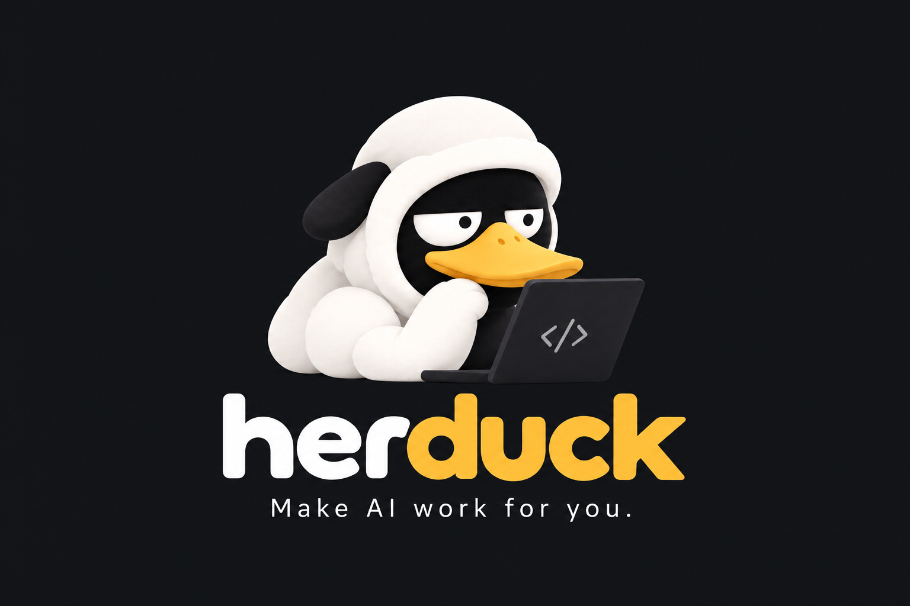
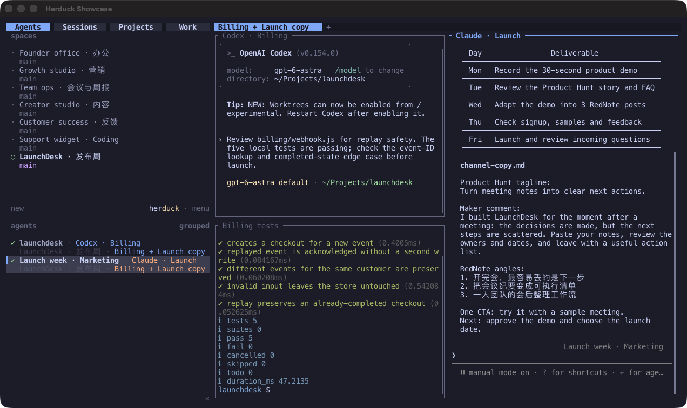
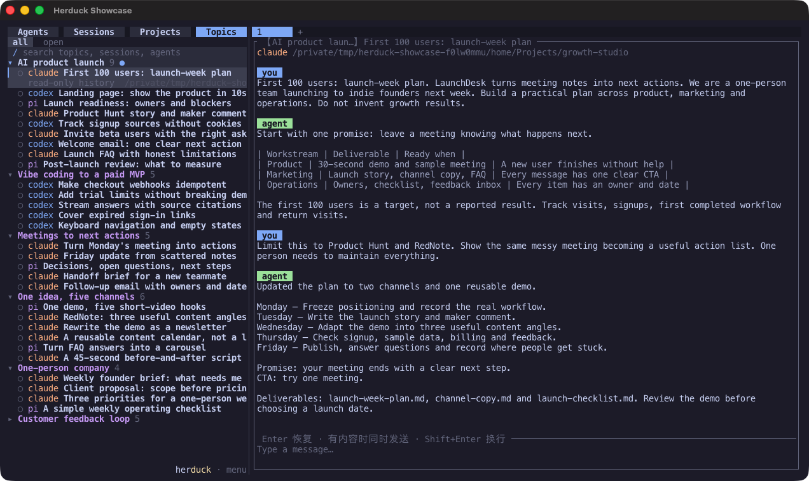
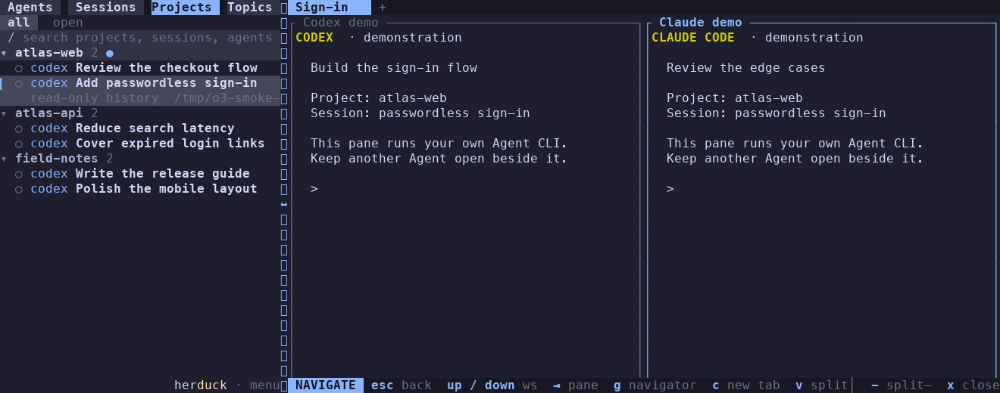
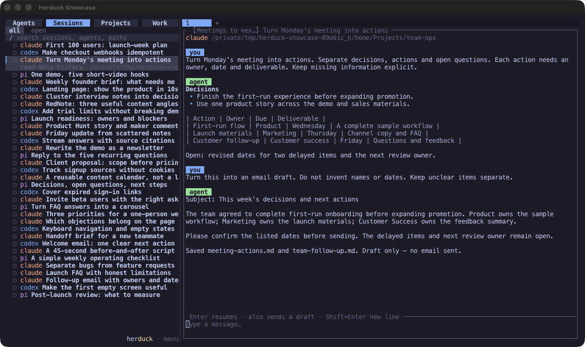

<p align="center">
  
</p>

<h1 align="center">An Agent window manager with a project dashboard.</h1>

<p align="center">
  Run your Agents. See their progress. Keep the whole project in view.
</p>

<p align="center">
  <a href="#install">Install</a> ·
  <a href="#features">Features</a> ·
  <a href="docs/configuration.md">Configuration</a> ·
  <a href="README.zh-CN.md">简体中文</a>
</p>

Herduck builds on [Herdr](https://github.com/ogulcancelik/herdr), a terminal manager and runtime
for Agents with a workflow familiar to **tmux** users. It keeps workspaces, tabs, split panes,
and persistent terminal sessions, and adds an **Agent activity dashboard, project views,
and a conversation library across your device**.

People and Agents can use the same workspace to follow work across projects: see which Agent
is working or needs attention, trace its conversation, and continue from the right context.
People use the terminal UI; Agents can inspect and manage the workspace through the CLI and JSON API.

## Features

| Capability | What it helps you manage |
| --- | --- |
| **Agents** | Arrange terminal windows and follow Agent activity across workspaces. |
| **Topics** | Automatically group related conversations across folders and Agents when semantic organization is enabled. |
| **Projects** | Organize work by directory, with a separate project view and workspaces you create. |
| **Sessions** | Browse supported Agent histories across this device, preview context, and resume a conversation. |
| **Shared controls** | Let people and Agents inspect status, manage panes, and coordinate work through the UI, CLI, and API. |
| **Model fallback** | Configure ordered Agent CLI and API sources for topic organization and session naming. |
| **Session lifecycle** | Recognize inactive Agents and resume saved history on demand; automatic process reclamation is planned. |

## Install

With **Node.js 20+** on macOS or Linux:

```sh
npm install -g herduck@alpha
herduck
```

Or try it without a global install:

```sh
npx --yes herduck@alpha
```

This is an **alpha release**. The launcher downloads a verified native binary on first use;
Rust and Zig are not needed. Install and sign in to your Agent CLIs separately.

Prebuilt downloads support Apple silicon and Intel Macs, and x64/arm64 Linux with glibc 2.39+
(such as Ubuntu 24.04). Windows and Alpine/musl are not supported by these downloads.
See [installation](docs/installation.md) for version pinning, GitHub archives, direct binaries,
source builds, upgrades, and troubleshooting.

## Agents: window management and a live overview

Run Agent CLIs side by side, split and resize panes with the mouse, and organize terminals into
tabs and workspaces. Detach the client and the server keeps those terminals running;
open `herduck` to attach again.

The Agent panel brings activity across workspaces into one view. Working, waiting for input,
finished, and inactive states have distinct visual cues. Click an entry to reach its terminal;
state changes and configurable notifications help you notice work that needs attention.



## Topics: organize work by meaning

Enable semantic organization to group related conversations into **Topics**, even when they
come from different project folders or Agents. Follow several topics in parallel, expand a
group, and inspect the conversations behind it. Recent activity keeps active topics easy to find.

Generation is opt-in. Existing Topics remain available when generation is off or a model source
is unavailable; new conversations can be organized when a source becomes available.



## Projects: keep a view for each directory

**Projects** follows the familiar folder structure of your work. Create a project directory
and a workspace for it; supported Agent conversations from that directory are indexed into
its project group. Each group gives you its own expandable view of recent and open sessions.

Browse a project, preview a conversation, and return to the relevant terminal. Project context
stays connected to the directory where the work happens.



## Sessions: your device's Agent conversation library

**Sessions** discovers supported local Agent histories, including conversations started outside
Herduck, and brings them into one searchable list. Current history adapters cover **Claude Code,
Codex, Pi, OpenCode, and Grok**. Additional history directories can be configured.

Preview a conversation without starting an Agent. Choose to continue it with its original Agent
when supported; Herduck focuses a matching running session instead of starting another instance.
Projects and Topics provide two more ways to navigate the same conversation history.



*Native Ghostty window captures of Herduck v0.1.0-alpha.2, using prepared example histories and
Topics. Agent panes show native CLIs, a prepared conversation, and local test output.
The examples illustrate the interface. [Capture notes](assets/screenshots/README.md).*

## Shared controls for people and Agents

The workspace is also accessible to Agents and scripts. The CLI and JSON API can list Agents,
read terminal output, send input, wait for state changes, and create or manage workspaces and panes.
Agents can report workspace metadata for display alongside the work.

For example, create a workspace for an existing project directory and inspect its Agents:

```sh
herduck workspace create --cwd /path/to/project --label my-project
herduck agent list
```

This connects project organization and visible Agent progress with controls that both people
and automation can use. Run `herduck agent --help` or see the [API schema](docs/api/herduck-api.schema.json).

## Multiple Agents and configurable model fallback

Herduck includes screen-state detection for **19 Agent CLIs**, including Claude Code, Codex,
OpenCode, Pi, Gemini CLI, Cursor, GitHub Copilot, Kimi, Grok, and Hermes. Detection and history
import have separate coverage; the five history adapters are listed above.

For topic organization and session naming, use **OpenCode, Pi, Codex, or Hermes CLI sources**,
or an **OpenAI-compatible API**. Configure the source order and each source's model order.
Model rejection advances to another model; startup or transport failure advances to another source.
If all sources fail, existing Topics remain available and session names fall back to local text.
Manual names are preserved. [Configure sources and fallback](docs/configuration.md#summary-sources-and-fallback-order).

## Session lifecycle and resource use

Browsing saved history does not launch an Agent. Continuing a conversation starts its Agent
when needed and reuses a matching running session. You can end an unneeded Agent process while
keeping the conversation history that its CLI saved for later review or supported resume.

After an hour without input, output, or state changes, an idle Agent is marked **inactive**.
Working Agents and those blocked on a response or approval are excluded. Inactivity marking keeps the process and
terminal alive; its threshold is configurable. [Inactive Agent settings](docs/configuration.md#inactive-agents).

**Planned: automatic process reclamation.** End inactive background processes after a configured
period to release memory, retain their saved history, and resume them on demand. This is not yet
implemented in the current alpha.

## Start with your own tools

The welcome opens configuration or lets you skip straight to a shell. Choose **herduck · menu → settings**,
or press **Ctrl+B, then S** from a terminal. The **Sessions**, **Summaries**, and **Session names**
pages show the loaded configuration and source order.

Use **Open config file** to edit, save, then close and reopen Settings to reload.
Run `herduck config check` to check the file. Your Agent authentication stays with each Agent.

Model-based summaries, names, and topics are **off by default**. To enable them, choose your
Agent or API sources in the configuration file. Selected conversation content is sent to those
sources when generation runs. Local-only naming is also available. See
[configuration and privacy](docs/configuration.md) for examples and data locations.

## Development

Follow the pinned [Rust and Zig setup](docs/installation.md#build-from-source), then run:

```sh
just build
just check
```

`just check` runs formatting, public-source checks, npm installer tests, Clippy, and Rust tests.
Repository recipes require `just`, `zsh`, Python 3, and Node.js 20+.
See [CONTRIBUTING.md](CONTRIBUTING.md) for review and [SECURITY.md](SECURITY.md) for private reports.

## License and origin

Herduck is an independent project derived from **Herdr v0.7.4**, distributed under
**AGPL-3.0-or-later**. It installs its own executable and needs no separate Herdr installation.
Original notices are preserved. See [LICENSE](LICENSE) and [upstream provenance](docs/UPSTREAM.md).
