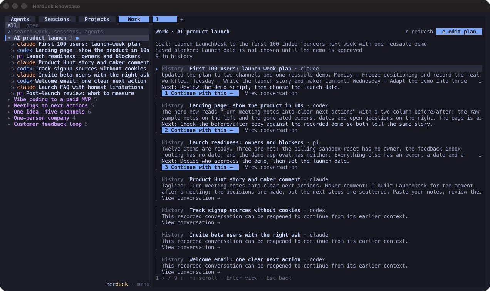

<p align="center">
  
</p>

<h1 align="center">The persistent work layer for Agents.</h1>

<p align="center"><strong>Agents execute. Herduck keeps the Work continuous.</strong></p>

<p align="center">
  <a href="#install">Install</a> ·
  <a href="#one-work-four-views">Four views</a> ·
  <a href="#work-continue-the-work-not-just-the-conversation">Work</a> ·
  <a href="#for-agents">For Agents</a> ·
  <a href="README.zh-CN.md">简体中文</a>
</p>

Herduck is the **work-context infrastructure** shared by people and Agents: it reassembles the
goal, current state, next steps, and supporting evidence scattered across Agents, sessions,
projects, and runtimes, so a piece of work stays whole, understandable, and ready to continue
from the right place.

## The problem

Claude Code investigates a problem. Codex implements a change. Another Agent finds a blocker.

The next day you open a new session, and the goal, decisions, attempts, and unfinished steps are
already scattered across different conversations.
**You have to piece the whole picture back together before the next Agent can continue.**

Getting a single Agent to finish a task keeps getting easier.

**Keeping one piece of work continuous across Agents and sessions is the hard part.**

## The idea

Herduck starts from one assumption:

> **The durable object is Work — not the session, the Agent, the model, or the terminal.**

A Work can span many sessions, Agents, directories, models, and runtimes, and last for hours,
days, or longer.

Herduck does not try to copy all of that history into a large project-management database.

It persists only the smallest state that matters for a Work:

**Goal, Status, Blocker, and Next Steps.**

Everything else — recent progress, key decisions, previous attempts, relevant context — is
understood dynamically from the evidence that already exists:

**conversations, sessions, files, git history, terminal output, and Agent runtime state.**

```text
Claude Code ─┐
Codex       ─┤
OpenCode    ─┼──▶  HERDUCK  ──▶  WORK
Pi          ─┤                    │
Cursor      ─┘              Goal · Status
                            Blocker · Next
                                  │
                                  ▼
                          Human / Next Agent
```

So what Herduck maintains is not the context of one conversation.

It is the **complete working context** a piece of work needs in order to continue after crossing
different execution environments.

**The Agent can change. The model can change. The session can change.
The Work stays understandable and ready to continue.**

## One Work, four views

| View | What it answers | Role |
| --- | --- | --- |
| **Work** | What are we trying to finish, where does it stand, what happens next? | Primary object |
| **Agents** | What is running right now, and what Work is it executing? | Execution |
| **Projects** | Where does the Work live? | Directory and environment context |
| **Sessions** | What actually happened? | History and evidence |

**Agents execute. Sessions record. Projects give context. Herduck keeps the Work.**

<table>
<tr>
<td width="50%" valign="top">
<strong>Work</strong><br>
<sub>The goal, blocker, and next step of one piece of work, with the conversations behind it and a way to continue each one.</sub><br><br>

</td>
<td width="50%" valign="top">
<strong>Agents</strong><br>
<sub>Parallel Agent terminals with working, waiting, idle, and inactive states at a glance.</sub><br><br>

</td>
</tr>
<tr>
<td width="50%" valign="top">
<strong>Projects</strong><br>
<sub>Everything happening around a working directory.</sub><br><br>

</td>
<td width="50%" valign="top">
<strong>Sessions</strong><br>
<sub>Every local Agent conversation, searchable, previewable, and resumable with its original Agent.</sub><br><br>

</td>
</tr>
</table>

<p align="center"><sub>Native Ghostty captures of Herduck alpha with prepared example histories. <a href="assets/screenshots/README.md">Capture notes</a>.</sub></p>

## Install

On macOS or Linux, install the [required Rust and Zig toolchain](docs/installation.md#build-from-source), then:

```sh
git clone https://github.com/wenhanweime/herduck.git
cd herduck
just install
herduck
```

Your Agent CLIs stay independently installed and signed in; Herduck uses their existing tools
and accounts. See [installation](docs/installation.md) for system dependencies, macOS signing,
PATH setup, prebuilt packages, and upgrades.

## Work: continue the work, not just the conversation

A session is a boundary drawn by a tool. It is rarely the boundary of the work.

Herduck gathers the fragments — conversations from different Agents and folders — into one
Work. Opening it shows what recent requests and Agent replies were about, alongside suggested
next steps. Above that sits the plan you own: an editable **goal**, up to three **next steps**,
and a **blocker** note. The plan survives sessions ending and the server restarting; automatic
updates never overwrite what you wrote.

Finding an old session is not the goal. The loop Herduck is built for is:

```text
Open the Work → understand where it stands → choose what happens next → continue with an Agent
```

Choose **Continue with this** and the selected follow-up goes to its original Agent: Herduck
reuses a matching live session or resumes the original conversation, and a busy Agent receives
the input once it is ready. **View conversation** opens the supporting evidence. New execution
becomes new evidence, and the Work is read again from it. Summaries can be regenerated and
decisions traced back to the conversation where they were made; only the goal and direction of
the work need to outlive a session. [Usage and API](docs/project-overview.md).

## Agents: see where execution is happening

Run Agent CLIs side by side, split and resize panes with the mouse, and organize terminals
into tabs and workspaces. Detach the client and the server keeps them running; open
`herduck` to attach again.

The Agent panel brings every workspace into one view: working, waiting for input, idle, and
inactive states have distinct cues, and configurable notifications flag work that needs
you. Select an entry to reach its terminal. Screen-state detection covers **19 Agent CLIs**,
including Claude Code, Codex, OpenCode, Pi, Gemini CLI, Cursor, GitHub Copilot, Kimi, Grok,
and Hermes.

Runtime state and Work state are intentionally different: an idle Agent is ready for the next
instruction, not proof that the work is done. After an hour without activity an idle Agent is
marked **inactive** while its process and terminal stay alive; working Agents and Agents waiting
for a response or approval are never marked. The threshold is
[configurable](docs/configuration.md#inactive-agents). Ending an unneeded process keeps the
history its CLI saved.

## Projects: keep the directory in view

Projects keeps the familiar folder structure, whether a directory holds code, documents, or
other working material. Create a project directory and a workspace for it; supported Agent
conversations from that directory appear in its group, with the same progress overview and
suggested next steps.

A Project is where the Work lives. It is not the Work itself — one directory holds many.

## Sessions: the evidence

Sessions discovers local Agent histories on this device, including conversations that never
started inside Herduck, and brings them into one searchable list. History adapters cover
**Claude Code, Codex, Pi, OpenCode, and Grok**; more history directories can be configured.
OpenCode histories are indexed, but their transcript preview is not yet available.

Preview a conversation without launching anything. Continue it with its original Agent when
supported; if a matching session is already running, Herduck focuses it instead of starting
another. Work and Projects are two more ways into the same history.

## For Agents

Herduck is built for both sides of the loop. Humans own goals and judgment through the
terminal UI. Agents get the same workspace through the CLI and JSON API:

```sh
herduck agent list                     # who is running, and in what state
herduck agent read <pane>              # what another Agent's terminal shows
herduck agent send <pane> "..."        # hand it input
herduck agent wait <pane>              # block until its state changes
herduck workspace create --cwd /path/to/project --label my-project
```

And the same Work plan the person sees, so an Agent joining a piece of work can ask *what are
we finishing, where does it stand, what is blocking us, what happens next* — and start:

```sh
herduck work list
herduck work plan get WORK_KEY
herduck work overview get WORK_KEY
herduck work plan update WORK_KEY \
  --goal "Verify the npm installer on a clean machine" \
  --next-step "Review the latest result" \
  --blocked-note "Waiting for feedback"
```

Commands return JSON; `WORK_KEY` is a `canonical_key` from `work list`. The goal is not an
infinitely large context window; it is the right state and the right evidence.
See the [plan API and guarded updates](docs/topic-covers.md) and
[follow-up controls](docs/project-overview.md#cli-and-socket-api).

## Model sources and privacy

Work grouping, session names, and progress descriptions are **off by default**. Enable them by
choosing model sources in the configuration file: **OpenCode, Pi, Codex, or Hermes CLI**, or any
**OpenAI-compatible API**. Sources and models are tried in the order you configure; a rejected
model advances to the next model, a failed source advances to the next source, and if all fail,
existing Work stays available and names fall back to local text. Manual names are never
overwritten.

Conversation indexing and saved plans live in local storage. When generation is enabled,
selected conversation content is sent to the sources you chose; using an Agent CLI as a source
can still call that Agent's remote model. Open Settings with **Ctrl+B, then S**, check the file
with `herduck config check`, and see [configuration and data locations](docs/configuration.md).

## Where Herduck fits

```text
Runtime             keeps an Agent running
Session management  keeps conversations accessible
Memory              keeps information available to one Agent
Knowledge           keeps learnings from previous sessions

Herduck             keeps the work continuous across all of them
```

Herduck complements the memory and knowledge tools your Agents already use; it reads recent
evidence rather than replacing it.

Herduck grew out of [Herdr](https://github.com/ogulcancelik/herdr), an Agent-aware terminal
runtime with a workflow familiar to tmux users. Herdr answers "Where are the Agents?"
Herduck adds "What work are they contributing to, and where can I continue?"

## Development

Follow the pinned [Rust and Zig setup](docs/installation.md#build-from-source), then run:

```sh
just build
just check
```

`just check` runs formatting, public-source checks, npm installer tests, Clippy, and Rust tests.
Repository recipes require `just`, `zsh`, Python 3, and Node.js 20+.
See [CONTRIBUTING.md](CONTRIBUTING.md) for review and [SECURITY.md](SECURITY.md) for private reports.

## License and origin

Herduck is an independent project derived from **Herdr v0.7.4**, distributed under
**AGPL-3.0-or-later**. It installs its own executable and needs no separate Herdr installation.
Original notices are preserved. See [LICENSE](LICENSE) and [upstream provenance](docs/UPSTREAM.md).
