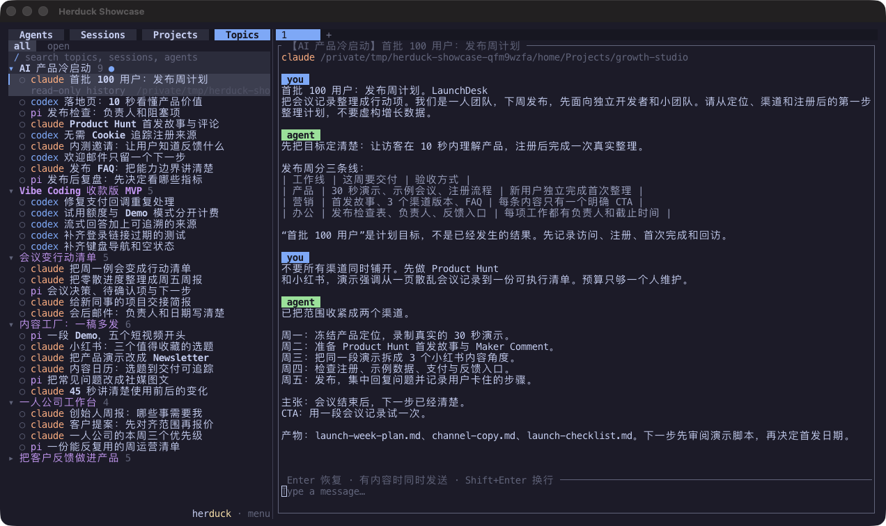
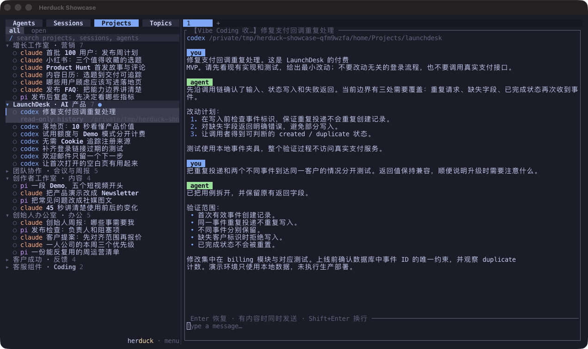
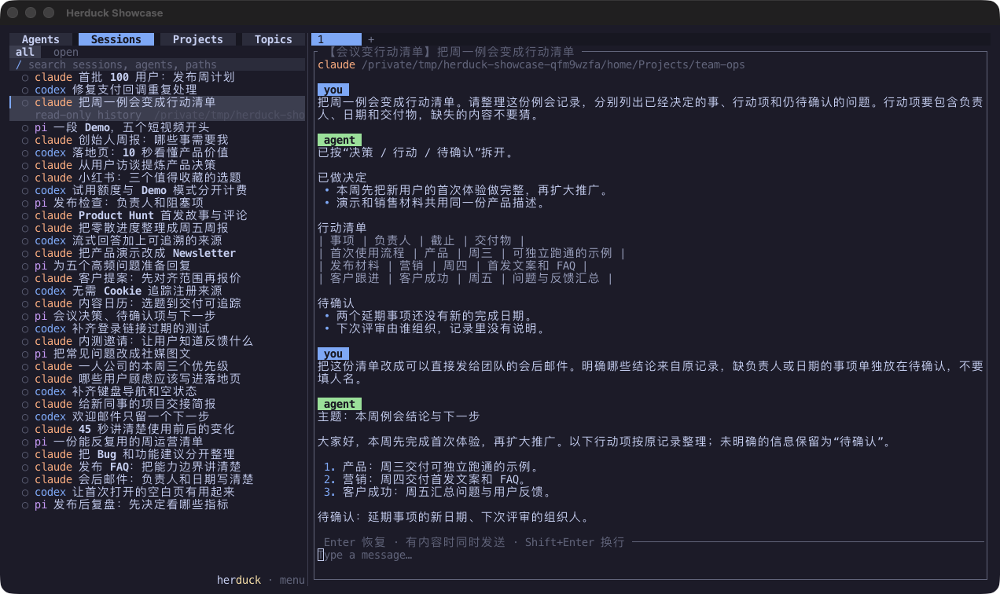

<p align="center">
  
</p>

<h1 align="center">Coding、营销、办公。一个 AI 工作台。</h1>

<p align="center">做产品、准备发布、找回工作上下文，接着上次的进度继续。</p>

<p align="center">
  <a href="#安装">安装</a> ·
  <a href="#一个产品发布周找齐散落的对话">使用场景</a> ·
  <a href="docs/configuration.md">配置文档</a> ·
  <a href="README.md">English</a>
</p>

用 Codex 修支付回调，用 Claude Code 准备首发文案，再让 Agent 把例会记录整理成行动项。
Herduck 把这些终端和对话放到一个工作台里，继续使用你熟悉的 Claude Code、Codex、OpenCode、Pi 等 CLI。

## 安装

macOS 或 Linux，安装 **Node.js 20+** 后运行：

```sh
npm install -g herduck@alpha
herduck
```

不想全局安装，可以直接体验：

```sh
npx --yes herduck@alpha
```

当前是 **alpha 预览版**。首次启动会下载对应系统的原生程序并校验 SHA-256，无需安装 Rust 或 Zig。
各个 Agent CLI 需要自行安装和登录。

预编译程序支持 Apple silicon / Intel Mac，以及 glibc 2.39+ 的 x64 / arm64 Linux
（例如 Ubuntu 24.04）。暂不支持 Windows 和 Alpine/musl。
[安装文档](docs/installation.md)包含固定版本安装、GitHub 下载、源码安装、升级和常见问题。

## 一个产品发布周，找齐散落的对话

“首批 100 用户”的计划涉及产品、营销和办公。**Topics** 把不同目录、不同 Agent 里的相关对话放到一起：
落地页、Product Hunt 首发故事、发布检查表和内测邀请，都能在 **AI 产品冷启动** 下找到。

还可以围绕 **Vibe Coding 收款版 MVP**、**内容工厂：一稿多发**、**会议变行动清单** 继续工作。
点击对话就能查看上下文。启用模型整理后可以生成 Topics；关闭生成后，已有分组仍会保留。



## 产品在开发，发布文案也在推进

**Agents** 里，Codex 准备审查支付代码，旁边保留本地测试结果，Claude Code 打开发布文案。
并排查看终端、切换焦点、用鼠标拖动调整大小。关闭客户端后，后台服务和终端继续运行；
重新打开 `herduck` 即可接回。


## 产品、营销、办公，各自有项目

**Projects** 按工作目录整理会话。回到 LaunchDesk 处理支付与首次体验，去增长工作室准备渠道内容，
在创始人办公室梳理提案和本周优先级。展开项目，先预览对话，再接着做。



## 找回那次会议，接着处理下一步

**Sessions** 汇集支持的本地 Agent 历史，最近的工作排在前面。找到会后跟进的对话，核对负责人和截止日期，
再用原来的 Agent 恢复支持继续的会话。如果它已经在运行，就直接切回对应终端。



*图片为 Herduck v0.1.0-alpha.2 在 Ghostty 中运行的原生窗口截图。LaunchDesk 为演示项目；
历史对话和主题标签为预设示例，Agent 页面展示原生 CLI、演示会话及本地测试结果。“首批 100 用户”为计划目标。
[截图说明](assets/screenshots/README.md)。*

## 用自己的工具，按自己的方式配置

欢迎页可以打开配置，也可以跳过后直接使用 shell。选择 **herduck · menu → settings** 打开设置，
也可以在终端中按 **Ctrl+B，再按 S**。Sessions、Summaries 和 Session names 展示当前配置、来源优先级和模型顺序。

点击 **Open config file** 修改配置文件，保存后关闭并重新打开设置即可加载。
`herduck config check` 可以检查文件。Agent 的登录继续由各自 CLI 管理。

模型摘要、命名和主题整理**默认关闭**。启用后，所选对话内容会发送给你配置的 Agent 或 API 来源；
也可以只使用本地命名。完整示例和数据位置见[配置文档](docs/configuration.md)。

## 开发与许可

按照[源码构建说明](docs/installation.md#build-from-source)安装固定版本的 Rust 和 Zig，
使用 `just build` 构建，使用 `just check` 运行完整检查。

Herduck 是基于 Herdr v0.7.4 的独立项目，采用 **AGPL-3.0-or-later**，保留上游版权和许可声明。
安装后直接运行 `herduck`，无需额外安装 Herdr。
参见[上游来源](docs/UPSTREAM.md)、[贡献说明](CONTRIBUTING.md)和[安全报告](SECURITY.md)。
