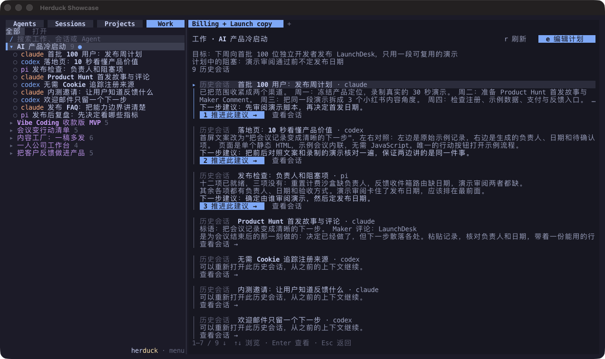

<p align="center">
  
</p>

<h1 align="center">面向 Agent 的持久工作层。</h1>

<p align="center"><strong>Agent 负责执行，Herduck 维护 Work 的连续性。</strong></p>

<p align="center">
  <a href="#安装">安装</a> ·
  <a href="#一个-work四个视图">四个视图</a> ·
  <a href="#work继续的是工作不只是对话">Work</a> ·
  <a href="#给-agent-用">给 Agent 用</a> ·
  <a href="README.md">English</a>
</p>

Herduck 是人和 Agent 共享的**工作上下文基础设施**：把散落在不同 Agent、Session、Project 和 Runtime 中的目标、当前状态、下一步以及相关证据重新组织在一起，让一项工作始终保持完整、可理解，并能从正确的位置继续。

## 问题

Claude Code 调查问题，Codex 实现修改，另一个 Agent 发现卡点。

第二天打开新的会话，目标、决策、尝试和未完成的步骤已经散落在不同对话里。
**你得先把工作的全貌重新拼回来，下一个 Agent 才能继续。**

让单个 Agent 把事情做出来越来越容易。

**难的是让同一份工作跨 Agent、跨会话保持连续。**

## 想法

Herduck 只有一个基本假设：

> **应该持久存在的对象是 Work——不是会话，不是 Agent，不是模型，也不是终端。**

一项 Work 可以跨越多个会话、多个 Agent、多个目录、多个模型和多个 Runtime，持续数小时、数天甚至更久。

Herduck 不试图把所有历史重新复制成一套庞大的项目管理数据库。

它只持久维护 Work 最小但关键的状态：

**目标、状态、卡点和下一步。**

其余信息——最近进展、关键决策、之前的尝试、相关上下文——尽量从已有证据中动态理解：

**Conversation、Session、Files、Git History、Terminal Output 和 Agent Runtime State。**

```text
Claude Code ─┐
Codex       ─┤
OpenCode    ─┼──▶  HERDUCK  ──▶  WORK
Pi          ─┤                    │
Cursor      ─┘              Goal · Status
                            Blocker · Next
                                  │
                                  ▼
                          Human / Next Agent
```

因此 Herduck 维护的不只是某一次对话的 Context。

它维护的是一项工作跨越不同执行环境之后，仍然能够继续所需要的**完整工作上下文**。

**Agent 可以换，模型可以换，会话可以换。
Work 始终可理解、可继续。**

## 一个 Work，四个视图

| 视图 | 回答什么问题 | 角色 |
| --- | --- | --- |
| **Work** | 我们要完成什么？现在到哪了？下一步做什么？ | 核心对象 |
| **Agents** | 现在谁在跑？在为哪项 Work 执行？ | 执行 |
| **Projects** | 这项 Work 在哪个目录里？ | 目录与环境上下文 |
| **Sessions** | 实际发生了什么？ | 历史与证据 |

**Agent 负责执行，Session 负责记录，Project 提供上下文，Herduck 保住 Work。**

<table>
<tr>
<td width="50%" valign="top">
<strong>Work</strong><br>
<sub>一项工作的目标、卡点和下一步，背后的对话，以及逐条继续的入口。</sub><br><br>

</td>
<td width="50%" valign="top">
<strong>Agents</strong><br>
<sub>并行的 Agent 终端，一眼看清工作中、等待输入、空闲和不活跃状态。</sub><br><br>

</td>
</tr>
<tr>
<td width="50%" valign="top">
<strong>Projects</strong><br>
<sub>围绕一个工作目录发生的一切。</sub><br><br>

</td>
<td width="50%" valign="top">
<strong>Sessions</strong><br>
<sub>本机所有 Agent 对话，可搜索、可预览、可由原 Agent 继续。</sub><br><br>

</td>
</tr>
</table>

<p align="center"><sub>Herduck alpha 在 Ghostty 中的原生截图，历史对话为预设示例。<a href="assets/screenshots/README.md">截图说明</a>。</sub></p>

## 安装

在 macOS 或 Linux 上准备[所需的 Rust 和 Zig 工具链](docs/installation.md#build-from-source)，然后运行：

```sh
git clone https://github.com/wenhanweime/herduck.git
cd herduck
just install
herduck
```

各个 Agent CLI 仍由你自行安装和登录，Herduck 使用它们已有的工具和账号。
[安装文档](docs/installation.md)包含系统依赖、macOS 签名、PATH 设置、预编译包和升级说明。

## Work：继续的是工作，不只是对话

会话是工具划出的边界，很少正好是工作的边界。

Herduck 把碎片——来自不同 Agent、不同目录的对话——聚成一项 Work。打开它，能看到近期请求和 Agent 回应在做什么，以及下一步建议。上方是由你掌握的计划：可编辑的**目标**、最多三条**下一步**和一条**卡点**备注。
计划在会话结束、服务重启后都保留；自动更新不会覆盖你写的内容。

找到旧会话不是目的。Herduck 围绕的是这个循环：

```text
打开 Work → 看清现在到哪了 → 决定下一步 → 交给 Agent 继续
```

点击 **推进此建议**，选定的跟进会交给原来的 Agent：Herduck 复用对应的运行中会话或恢复原始对话，
Agent 忙碌时先排队、就绪后再发送。**查看会话** 打开支撑它的证据。新的执行变成新的证据，Work 再从证据里被重新读出来。摘要可以重新生成，决策可以追溯到做出它的那段对话；真正需要活过会话结束的，只有工作的目标和方向。
[使用说明与 API](docs/project-overview.md)。

## Agents：看清执行发生在哪

并排运行不同的 Agent CLI，用鼠标分屏、调整大小，在标签页和工作区之间切换。
退出客户端后，后台服务继续维持终端；重新打开 `herduck` 即可接回。

Agent 面板把所有工作区放到一个视图里：工作中、等待输入、空闲和不活跃状态有各自的提示，
可配置的通知会提醒你需要接手的工作，点击条目即可回到对应终端。界面状态识别覆盖 **19 种 Agent CLI**，
包括 Claude Code、Codex、OpenCode、Pi、Gemini CLI、Cursor、GitHub Copilot、Kimi、Grok 和 Hermes。

运行状态和 Work 状态是两回事：Agent 空闲只表示它可以接下一条指令，不代表工作完成。
Agent 连续一小时没有活动后会被标记为 **inactive**，进程和终端仍然保留；正在工作或等待你答复、确认的 Agent 不会被标记。
阈值[可配置](docs/configuration.md#inactive-agents)。手动结束不需要的进程时，其 CLI 保存的历史会留下来。

## Projects：让目录保持在视野里

Projects 沿用你熟悉的文件夹结构，目录里可以是代码、文档或其他工作材料。
创建项目目录并为它新建工作区，该目录下支持的 Agent 对话就会归入它的分组，同样带有进展概览和下一步建议。

Project 是 Work 所在的地方，但不是 Work 本身——一个目录里会有很多项 Work。

## Sessions：证据

Sessions 自动发现本机的 Agent 历史——包括不在 Herduck 里开始的对话——汇成一个可搜索列表。
历史适配器支持 **Claude Code、Codex、Pi、OpenCode 和 Grok**，也可以配置额外的历史目录。OpenCode 已支持历史索引，暂不支持对话正文预览。

预览对话不会启动任何东西。选择继续时由原来的 Agent 恢复支持续接的会话；如果对应会话已在运行，直接切回它。
Work 和 Projects 是进入同一份历史的另外两条路。

## 给 Agent 用

Herduck 服务于循环的两端。人通过终端界面掌握目标和判断，Agent 通过 CLI 和 JSON API 使用同一个工作台：

```sh
herduck agent list                     # 谁在跑，什么状态
herduck agent read <pane>              # 另一个 Agent 的终端里是什么
herduck agent send <pane> "..."        # 给它输入
herduck agent wait <pane>              # 等它状态变化
herduck workspace create --cwd /path/to/project --label my-project
```

Agent 读到的 Work 计划和人看到的是同一份。新加入一项工作的 Agent 可以直接问：*我们要完成什么、到哪了、
卡在哪、下一步做什么*——然后开工：

```sh
herduck work list
herduck work plan get WORK_KEY
herduck work overview get WORK_KEY
herduck work plan update WORK_KEY \
  --goal "在干净机器上验证 npm 安装器" \
  --next-step "审核最新结果" \
  --blocked-note "等待反馈"
```

命令返回 JSON，`WORK_KEY` 取自 `work list` 里的 `canonical_key`。目标不是给每个 Agent 无限大的上下文窗口，
而是给它对的状态和对的证据。详见[计划接口与并发修改保护](docs/topic-covers.md)及
[跟进控制](docs/project-overview.md#cli-and-socket-api)。

## 模型来源与隐私

Work 归类、会话命名和进展描述**默认关闭**。在配置文件里选择模型来源即可启用：**OpenCode、Pi、Codex、Hermes CLI**，
或任意 **OpenAI 兼容 API**。来源和模型按你配置的顺序尝试：模型被拒绝时换下一个模型，来源失败时换下一个来源；
全部失败时已有 Work 继续保留，会话名回退到本地文本。手动命名不会被覆盖。

会话索引和已保存的计划都存在本地。启用生成后，所选对话内容会发送给你配置的来源；使用 Agent CLI 作为来源，
也可能调用它的远程模型。按 **Ctrl+B，再按 S** 打开设置，用 `herduck config check` 检查配置文件，
数据位置见[配置文档](docs/configuration.md)。

## Herduck 处在哪一层

```text
运行时          让 Agent 跑起来
会话管理        让对话找得到
记忆            让信息对某一个 Agent 可用
知识            留住之前会话里学到的东西

Herduck         让工作跨越以上所有层持续下去
```

Herduck 与 Agent 已有的记忆和知识工具配合使用：它读取近期证据，而不是取代它们。

Herduck 源自 [Herdr](https://github.com/ogulcancelik/herdr)——一个面向 Agent、操作方式类似 tmux 的终端运行时。
Herdr 回答"Agent 在哪里？"，Herduck 进一步回答"它们在参与哪些工作，我该从哪里继续？"。

## 开发

按照[源码构建说明](docs/installation.md#build-from-source)安装固定版本的 Rust 和 Zig，然后运行：

```sh
just build
just check
```

`just check` 包含格式、公共源码检查、npm 安装器测试、Clippy 和 Rust 测试。
仓库命令还需要 `just`、`zsh`、Python 3 和 Node.js 20+。参见[贡献说明](CONTRIBUTING.md)和[安全报告](SECURITY.md)。

## 许可与来源

Herduck 是基于 **Herdr v0.7.4** 的独立项目，采用 **AGPL-3.0-or-later**，保留上游版权和许可声明。
安装后直接运行 `herduck`，无需额外安装 Herdr。参见 [LICENSE](LICENSE) 和[上游来源](docs/UPSTREAM.md)。
