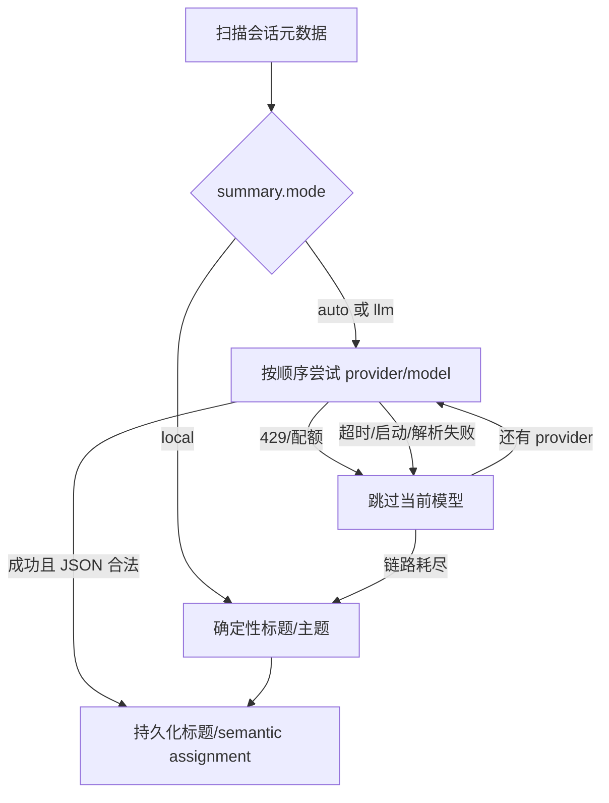

# PRD：公开版会话摘要与主题 Provider

> 状态：执行版 v0.1  
> 日期：2026-09-01  
> 读者：维护者 + coding agent  
> 关联：`docs/SPEC-semantic-project-clustering.md`

## 0. One-liner

ork3 在不依赖任何云端账号时仍能生成可读的会话标题和主题；用户也可以通过配置切换到本机 Agent、OpenCode Zen 免费模型或任意 OpenAI-compatible API，并在服务不可用时自动降级而不阻塞 TUI。

**Done when：** 默认安装即可使用本地摘要；配置 `mode = "llm"` 或 `"auto"` 时能按 provider 顺序生成标题/主题；网络、密钥、配额或 Agent CLI 失败时，UI 仍显示会话且结果回退到确定性算法。

## 1. Context

| | |
|---|---|
| **问题** | 当前语义聚类和标题只会调用固定的本机 CLI，公开用户没有统一配置入口，也无法使用 OpenAI-compatible 网关或本地 LLM。 |
| **用户** | 使用 ork3 管理 Codex、Claude、OpenCode、Pi、Hermes 等历史会话的开发者。 |
| **为何现在** | 需要把本机工作流整理成可上传 GitHub、开箱可用且不强制云端账号的公开版本。 |

## 2. Scope

### In（P0 必须）

- `local / llm / auto` 三种摘要模式；默认 `auto`。
- 确定性本地标题/主题算法，完全不启动进程、不发网络请求。
- 统一 provider 描述：CLI Agent 和 OpenAI-compatible HTTP。
- 内置 provider preset：Hermes 兼容的 OpenCode Free（无密钥、匿名、best-effort）、OpenCode CLI、Pi CLI、Codex CLI、Hermes CLI；付费 OpenCode Zen 通过显式配置接入；Ollama/OpenRouter/LM Studio/LiteLLM 通过同一兼容协议接入。
- 用户自定义 endpoint、模型列表和 `api_key_env`；只从环境变量读取密钥。
- provider 顺序、模型轮换、超时、429/配额识别和失败回退。
- 标题与 Cluster 共用同一 provider 链，保留现有批处理、指纹和持久化语义。
- 配置示例、公开版文档和可执行测试。

### In（P1，有空再做）

- TUI/CLI 中实时切换模式和 provider。
- provider 健康状态、剩余配额、动态模型目录。
- 系统钥匙串/Secret Service 集成。
- Hermes/Nous Portal 的专用 OAuth 流程。

### Non-goals

- 不在仓库或二进制中内置真实 API key、OAuth token 或用户 transcript。
- 不把 Hermes、LiteLLM、Ollama 等作为运行时硬依赖；它们只是可选 provider。
- 不修改任何 Agent 原始历史文件，不把语义 assignment 覆盖目录 assignment。
- 不承诺 OpenCode Zen 免费模型的稳定性、额度或永久免费；它是 best-effort 入口。
- 不在本版本实现通用多租户代理、计费、上传全文检索或远程同步。

## 3. Constraints

| 类型 | 内容 |
|---|---|
| **Stack** | Rust 2021；现有 `ProjectService`、`semantic.rs`、`title.rs`、SQLite Catalog。HTTP 使用 `reqwest` blocking + rustls；不引入异步运行时。 |
| **集成** | OpenCode Free/Zen `https://opencode.ai/zen/v1/chat/completions`；OpenRouter/LiteLLM/LM Studio 等通过自定义 OpenAI-compatible endpoint；Ollama 默认 `http://localhost:11434/v1/chat/completions`。 |
| **性能** | 摘要始终在后台线程；单请求超时默认 120s；批量大小和回填间隔可配置；`local` 模式不得启动 CLI 或网络请求。 |
| **安全** | 配置只保存环境变量名，不保存 key 值；日志禁止输出 Authorization、请求正文和 transcript；HTTP 仅发送有界摘要 envelope。 |
| **命令** | 格式/测试：`just check`；快速单测：`cargo test projects::semantic projects::title`；构建：`cargo build`。 |

## 4. Main flow



文字步骤：

1. Adapter 只把稳定 key、标题、cwd、backend、时间和有界 transcript evidence 放入 Catalog。
2. Worker 根据 `mode` 选择本地算法或 provider 链；每个批次整体成功或整体失败。
3. HTTP provider 使用 OpenAI chat-completions 结构，CLI provider 使用无 session 的一次性命令。
4. 429/配额错误只跳过当前模型；不可用、超时或非法 JSON 跳过当前 provider；全部失败后执行本地算法并记录诊断。
5. 结果通过现有 Catalog/event snapshot 发布，目录视图不受语义失败影响。

## 5. Features

### F1. 摘要模式 · P0

**行为：** `projects.summary.mode` 接受 `local`、`llm`、`auto`，默认 `auto`。

**Acceptance criteria：**

1. Given `mode = "local"`，When worker 处理批次，Then 不调用 `Command`、不建立 HTTP 连接，并生成稳定的标题/主题。
2. Given `mode = "auto"` 且所有 provider 失败，When 批次结束，Then Catalog 仍有本地标题/主题，且下一轮仍可重试 LLM。
3. Given `mode = "llm"` 且 provider 成功，When 返回合法 JSON，Then `title_backend`/`model_used` 记录实际 provider；非法或不完整回复不得写入半批结果。

### F2. Provider 配置 · P0

**行为：** 支持内置 preset 与 `[[projects.summary.providers]]` 自定义条目。

数据模型：

```text
SummaryConfig:
  mode: local | llm | auto
  providers: SummaryProviderConfig[]
  batch_size, max_sessions_per_run, timeout_secs, startup_grace_secs, idle_backfill_secs

SummaryProviderConfig:
  id: string
  kind: cli | openai_compatible
  command?: string
  endpoint?: string
  api_key_env?: string
  models: string[]
```

**Acceptance criteria：**

1. Given空的 `[projects.summary]`，When加载配置，Then使用内置 provider 顺序且现有旧配置仍可解析。
2. Given `api_key_env = "OPENROUTER_API_KEY"`，When请求 provider，Then只读取该环境变量；配置文件和日志中不出现 key 值。
3. Given endpoint 缺失、kind 不匹配或数值为 0，When加载配置，Then产生诊断并跳过无效 provider，不影响目录扫描。

### F3. OpenCode Free 免费入口 · P0

**行为：** 默认链首包含 Hermes 官方使用的 `opencode_free` preset，指向
`https://opencode.ai/zen/v1/chat/completions`。该入口无需 API Key，发送匿名请求，且绝不
发送 `Authorization: Bearer public`。当前模型顺序为 `laguna-s-2.1-free`、
`mimo-v2.5-free`、`ling-3.0-flash-free`、`big-pickle`；OpenCode live catalog 可能变化。

**Acceptance criteria：**

1. Given未设置任何 key，When OpenCode Free 返回 200 且 choices[0].message.content 为合法 JSON，Then结果被接受且请求不含 Authorization header。
2. Given OpenCode Free 返回 429/`FreeUsageLimitError`，When处理批次，Then记录 quota 诊断并立即尝试下一个模型/provider，不对同一模型重试。
3. Given OpenCode Free 不可达，When启动 ork3，Then TUI 首帧和目录/会话树仍可用，且降级到本地算法或后续 provider。

付费 OpenCode Zen 是可选 provider，不在默认链中。用户必须配置
`api_key_env = "OPENCODE_ZEN_API_KEY"`；ORK3 只从该环境变量读取密钥。

### F4. OpenAI-compatible HTTP · P0

**行为：** 以 chat-completions JSON 调用 OpenRouter、LiteLLM、LM Studio、Ollama 等兼容服务。

**Acceptance criteria：**

1. Given mock endpoint，When收到请求，Then body 含 `model`、单条 user message 和有界 prompt，Authorization 仅在配置 key env 有值时发送。
2. Given非 2xx、空 choices、非字符串 content 或 JSON 解析失败，When处理，Then该 provider 失败且不写入部分结果。
3. Given超时，When处理，Then worker 在配置时限内返回并继续 fallback，不阻塞输入线程。

### F5. 本机 Agent CLI · P0

**行为：** 保留 OpenCode、Pi、Codex、Hermes 的一次性 CLI 调用；命令不可持久化会话。

**Acceptance criteria：**

1. Given Pi provider，When构造命令，Then包含显式 `--model`、`-nt -ns -np -nc --no-session --offline`。
2. Given OpenCode provider，When构造命令，Then包含 `run --pure`，并使用隔离的 `XDG_DATA_HOME`。
3. Given CLI 不存在或退出超时，When处理，Then继续 provider 链且不产生 orphan process。

### F6. 本地确定性算法 · P0

**行为：** 从已有生成标题的 `【对象】任务`、cwd basename 和 backend 提取归一化 topic；同一对象得到稳定 topic key。

**Acceptance criteria：**

1. Given两个相同对象但不同 cwd/backend 的会话，When local clustering，Then topic key 相同。
2. Given标题只有“继续/看下”等低信号文本，When local title fallback，Then使用目录或 backend，不生成空标题。
3. Given相同输入重复运行，When比较结果，Then标题、topic key 和排序完全一致。

### F7. 可观测性与隐私 · P0

**Acceptance criteria：**

1. Given provider 失败，When查看 tracing，Then只出现 provider id、错误类别和耗时，不出现 key、Authorization 或 transcript 正文。
2. Given一次 fallback，When读取 Catalog，Then `title_source`/`title_status` 与现有字段一致，且未覆盖人工 custom title 或 locked assignment。
3. Given重启，When已有 fingerprint 未变化，Then不重复调用 provider；新增/变更会话仍进入队列。

## 6. Boundaries

- **Always：** 遵守仓库 `AGENTS.md`；先运行测试再提交；整批解析；本地算法可用；secrets 只通过环境变量；更新公开配置示例。
- **Ask first：** 改 wire protocol、改 SQLite schema、引入新的认证/遥测服务、上传完整 transcript、推送远程分支或创建 PR。
- **Never：** 提交真实密钥；把用户正文写入日志；因云端失败阻塞 TUI；把 semantic assignment 当作目录事实；自动安装或启动用户未授权的 Agent。

## 7. Open questions

- Assumption: `auto` 默认优先 Hermes 兼容的 OpenCode Free keyless 入口，再按配置顺序尝试本机 CLI/兼容 endpoint，最后使用 local；不承诺免费入口可用率。
- Note: Nous Portal 也曾提供限时 `:free` 模型活动，但活动模型和时间窗口不稳定，不作为默认 provider。
- Assumption: `llm` 仍保留 local fallback，以保证标题/Cluster 不为空；UI 诊断区分“LLM 成功”和“本地回退”。
- [NEEDS CLARIFICATION: P1 是否需要在 TUI 内编辑 provider/key 环境变量？本版本先使用 `config.toml` + 环境变量。]

## 8. Gaps vs current code

- 已有：后台扫描、Catalog 持久化、批量 semantic parser、标题严格校验、CLI provider 隔离和失败回填。
- 缺失：summary mode 配置；provider 抽象；OpenAI-compatible HTTP；OpenCode Zen preset；本地确定性 topic；统一 provider 诊断；从 `Config` 向 worker 传递设置；公开配置文档。
- 本次实现以本 Spec 的目标行为和 acceptance criteria 为准；旧的 `SemanticConfig::default()` 仅作为兼容测试入口，应用启动改为读取 `[projects.summary]`。

## Tasks

- [ ] T1 配置模型与 preset 默认值（deps: —）verify: 配置反序列化单测
- [ ] T2 provider 抽象、HTTP client、CLI 适配与错误分类（deps: T1）verify: provider 单测
- [ ] T3 local mode 标题/主题算法与 worker wiring（deps: T1）verify: semantic/title 单测
- [ ] T4 App 启动/恢复路径传入配置，补充文档和示例（deps: T1–T3）verify: `just check`
- [ ] T5 提交公开版变更（deps: T4）verify: `git status` clean + commit
