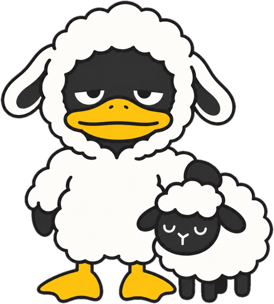
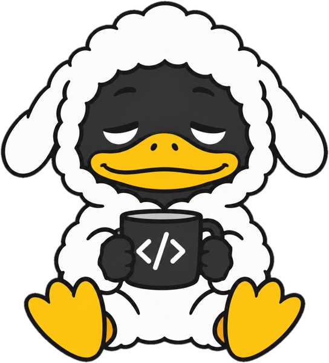

<p align="center">
  
</p>

<h1 align="center">herduck</h1>
<p align="center"><b>Make AI work for you.</b></p>
<p align="center">One terminal for every coding agent you run. Organized, searchable, never lost.</p>

<p align="center">
  <!-- TODO: replace with real capture: assets/demo.gif (3 agents → Sessions → Topics, ~12s) -->
  
</p>

```bash
npm install -g herduck      # or: curl -fsSL https://raw.githubusercontent.com/wenhanweime/herduck/main/install.sh | sh
herduck
```

<!-- ============================================================ -->

## The problem

You run Claude Code in one tab, Codex in another, a third agent on a side project.
Half an hour later:

| | |
| --- | --- |
|  | **Too many windows.** Every agent wants its own terminal. You lose track of which one is doing what. |
|  | **No memory.** Close the terminal, the conversation is gone. Resume means scrolling logs or starting over. |
|  | **No overview.** Which session was the auth bug? Which project was that database migration in? |


## What Herduck does

Herduck is a persistent terminal workspace for AI coding agents. Agents keep running when you
close the window. Every session is named, grouped, and one keypress away.

**Agents** — live workspaces, tabs, and split panes. Mouse-first, keyboard-fast.

**Sessions** — every conversation, newest first, with a readable title instead of a UUID.

**Projects** — sessions grouped by the directory they ran in.

**Topics** — sessions grouped by what they were about, across projects.

Works with Claude Code, Codex, Gemini CLI, OpenCode, and any CLI agent. Detects them automatically.

## Why not tmux

tmux keeps processes alive. Herduck also knows *what* is running: which agent, which project,
what the conversation was about, and whether it is waiting for you. It is the difference between
a list of PIDs and a list of work.

## Install

**npm**

```bash
npm install -g herduck
```

**Shell**

```bash
curl -fsSL https://raw.githubusercontent.com/wenhanweime/herduck/main/install.sh | sh
```

**From source** — see [docs/build.md](../build.md). Requires Rust 1.96 and Zig 0.15.2.

macOS and Linux, x86_64 and arm64. Windows is not yet validated.

## Quick start

```bash
herduck                  # open or attach to the workspace
herduck --help
herduck status
herduck server stop
```

Ctrl+B then S opens Settings from any tab. Configuration lives in `~/.config/herduck/config.toml`;
run `herduck --default-config` for an annotated template and `herduck config check` to validate.

Session titles and topic grouping can use a local model or any OpenAI-compatible endpoint. Off by
default; nothing leaves your machine until you turn it on. See [Configuration](../configuration.md).

## Status

Alpha. It works daily for the author; expect rough edges. Bugs and repros welcome in
[Issues](https://github.com/wenhanweime/herduck/issues); ideas in
[Discussions](https://github.com/wenhanweime/herduck/discussions).

Herduck is derived from [Herdr](https://github.com/ogulcancelik/herdr) and runs independently.
See [docs/UPSTREAM.md](../UPSTREAM.md).

## License

AGPL-3.0-or-later. See [LICENSE](../../LICENSE).
